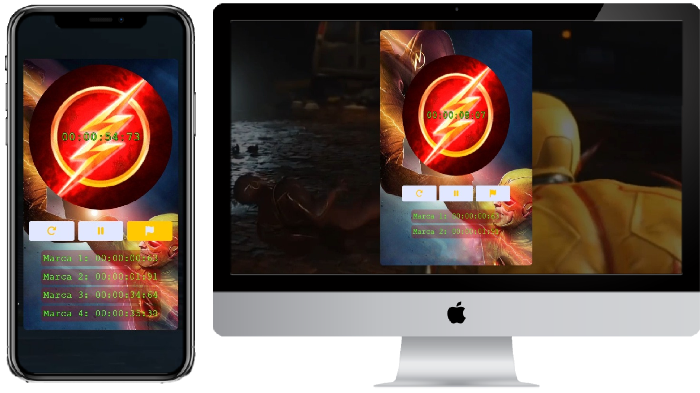

[Projeto ONLINE, experimente agora](https://anderdev-github.github.io/app-web-cronometro-online/)  

<h3 align="center">
  Seja bem-vindo ao meu projeto de um app web de Cronômetragem!
</h3>

 

  <a href="#house-sobre-o-projeto">Sobre o projeto</a>&nbsp;&nbsp;&nbsp;|&nbsp;&nbsp;&nbsp;
  <a href="#gear-funcionalidades">Funcionalidades</a>&nbsp;&nbsp;&nbsp;|&nbsp;&nbsp;&nbsp;
  <a href="#man_shrugging-como-funciona">Como Funciona</a>&nbsp;&nbsp;&nbsp;|&nbsp;&nbsp;&nbsp;
  <a href="#open_book-como-usar">Como Usar</a>&nbsp;&nbsp;&nbsp;|&nbsp;&nbsp;&nbsp;
  <a href="#zap-tecnologias">Tecnologias</a>&nbsp;&nbsp;&nbsp;|&nbsp;&nbsp;&nbsp;
  <a href="#balance_scale-licença">Licença</a>&nbsp;&nbsp;&nbsp;|&nbsp;&nbsp;&nbsp;
  <a href="#man_technologist-autor">Autor</a>&nbsp;&nbsp;&nbsp;|&nbsp;&nbsp;&nbsp;

 

 

## :house: Sobre o projeto

Este é um projeto de um cronômetro online com a temática "Flash vs Flash Reverso". Ele permite que você inicie, pause, reinicie o cronômetro e marque o tempo em até quatro pontos diferentes.

## :gear: Funcionalidades

O projeto possui as seguintes funcionalidades:

1. Iniciar o cronômetro.

2. Pausar o cronômetro.

3. Reiniciar o cronômetro.

4. Marcar o tempo em até quatro pontos.

5. Exibir as marcações de tempo realizadas.

## :man_shrugging: Como Funciona

O projeto utiliza JavaScript para controlar a funcionalidade do cronômetro. Quando você clica no botão "Iniciar", o cronômetro começa a contar. Você pode pausá-lo, reiniciá-lo e marcar o tempo atual. As marcações de tempo são exibidas na parte inferior da página.

## :open_book: Como Usar

1. Clone este repositório ou baixe os arquivos para o seu computador ou acesse online.

2. Clique no botão "Iniciar" para iniciar o cronômetro.

3. Clique no botão "Pausar" para pausar o cronômetro.

4. Clique no botão "Reiniciar" para zerar o cronômetro.

5. Clique no botão "Marcar" para registrar o tempo atual. Você pode fazer isso até quatro vezes.

6. As marcações de tempo serão exibidas na parte inferior da página.

## :zap: Tecnologias

-  : Contém a estrutura HTML da página.
-  : Estiliza a página.
-  : Controla a funcionalidade do cronômetro.

## :balance_scale: Licença

Este projeto é de código aberto e está sob a licença Licença MIT. Você é livre para usar, modificar e distribuir este projeto de acordo com os termos da licença.

## :man_technologist: Autor

Feito com ♥ por Anderson Leite :wave: [Entre em contato!](https://www.linkedin.com/in/andersondiasleite/)
